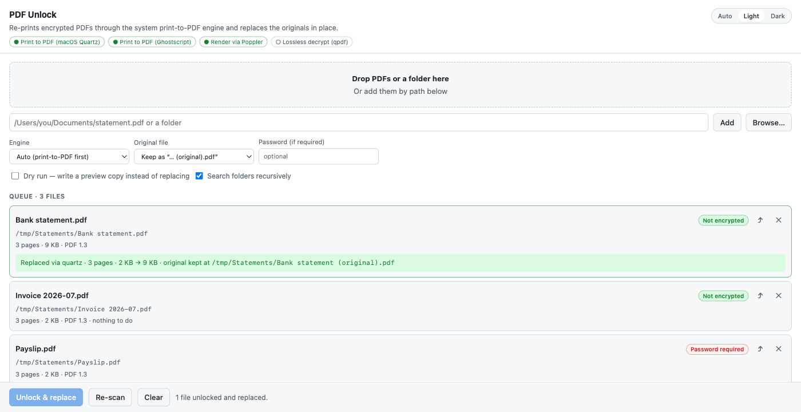

# PDF Unlock

> **The chore nobody automates:** bank statements, payslips and invoices arrive locked. You can read them, but you cannot copy a figure out, annotate them, or feed them to a tool. The usual workaround is to open each one and "Print → Save as PDF" by hand. PDF Unlock does exactly that, in bulk, and puts the result back where the original was.

PDF Unlock is a community-built Copilot canvas extension with the internal extension ID `pdf-unlock`. It is not an official GitHub product or endorsed feature.



## What it does

- Queues PDFs by drag-and-drop, native file picker, or pasted file and folder paths, scanning folders recursively.
- Reports each file's real state before you touch it: encryption algorithm, page count, PDF version, and which permissions the document blocks.
- Re-prints every page into a brand-new PDF, so the output is authored from scratch and carries no encryption dictionary and no permission flags. Text stays selectable vector text and is not rasterized.
- Unlocks files that need a password to open, once you supply that password.
- Leaves files that are not encrypted completely untouched, so a bulk run never degrades a document that was already fine.
- Offers a dry run that writes `… (unlocked preview).pdf` next to the original instead of replacing it.
- Keeps the original as `… (original).pdf`, moves it to the Trash or Recycle Bin, or overwrites it — your choice.
- Follows Copilot's light and dark themes, with an explicit Auto / Light / Dark switch.

## How the replacement stays safe

Replacing a file in place is destructive, so every conversion has to earn it:

1. The new file is written to a staging name in the same directory, which keeps the final swap an atomic rename on the same volume.
2. The result is verified — it must be readable, non-empty, free of any encryption dictionary, and have a page count that matches the source. A converter that cannot read its input often still writes a structurally valid but empty PDF, so an unreadable or zero page count is treated as a failure.
3. The original is re-hashed and compared, to catch it changing on disk while the conversion ran.
4. Only then is the original moved aside and the new file renamed into place, preserving the original's permissions and modification time.

If any step fails, the staging file is removed, the original is restored, and the next engine in the chain is tried. Nothing is replaced on a failed verification.

## Engines

`Auto` prefers the re-printing engines, matching the print-to-PDF intent, and falls back through the list. You can also pin a specific engine.

| Engine | Platform | Notes |
| --- | --- | --- |
| Print to PDF (Quartz) | macOS | The CoreGraphics pipeline behind *Print → Save as PDF*. Needs Xcode Command Line Tools; a small Swift helper is compiled once on first use. |
| Print to PDF (Ghostscript) | macOS, Windows, Linux | Ghostscript's `pdfwrite` device, with downsampling disabled and JPEG pass-through so images are not quietly degraded. |
| Render via Poppler | macOS, Windows, Linux | `pdftocairo -pdf`. A useful fallback when a primary engine refuses a malformed file. |
| Lossless decrypt (qpdf) | macOS, Windows, Linux | Strips the encryption dictionary without re-drawing, so links, bookmarks, form fields and annotations survive. |

Because a re-printed page is drawn from scratch, interactive extras do not survive it: links, bookmarks, form fields, annotations and attachments are dropped. Choose the qpdf engine when you need to keep them.

## Prerequisites

The panel shows which engines are available and, when none are, the exact command to install one.

- **macOS** — Xcode Command Line Tools (`xcode-select --install`) enables the Quartz engine. Optional: `brew install ghostscript`, `brew install qpdf`, `brew install poppler`.
- **Windows** — `winget install ArtifexSoftware.GhostScript` for the primary engine. Optional: `winget install qpdf.qpdf`.

File inspection itself has no dependencies: a structural scan of the PDF always runs, and qpdf, Poppler and Quartz layer richer detail on top when installed.

## Install

Ask Copilot to install the committed extension:

```text
Install this extension: https://github.com/github/awesome-copilot/tree/main/extensions/pdf-unlock
```

You can also copy the folder to one of the supported extension locations:

- `~/.copilot/extensions/pdf-unlock/` for user scope
- `.github/extensions/pdf-unlock/` for project scope

Reload extensions, then ask Copilot to open the `pdf-unlock` canvas. You can optionally pass files or folders to queue when opening it.

## Agent actions

- `add_files { paths, password? }` - queue PDF files or folders and report their encryption status.
- `list_files` - list the queued PDFs with their current status and results.
- `set_options { method?, backup?, dryRun?, recursive? }` - change the engine, what happens to each original, or whether to only write previews.
- `unlock_all { password?, dryRun? }` - unlock every queued PDF that can be opened and replace each original in place.
- `capabilities` - report which conversion engines are available on this machine.

## Security and local data

The canvas is served from an ephemeral `127.0.0.1` port, one server per canvas instance. Every `/api/*` request must present a per-instance capability token that only ever reaches the renderer inlined in the served HTML, so another local process cannot drive the panel.

Nothing leaves the machine: there are no network calls, no telemetry, and passwords are held only for the duration of a conversion — they are never written to disk. The extension reads and writes only the files you queue, plus the compiled macOS helper cached under `$COPILOT_HOME/extensions/pdf-unlock/bin/` (defaulting to `~/.copilot`).

## Scope

This extension is for documents you are already able to open and print — the print-to-PDF route only works when the PDF grants you that access. It removes the friction of permission flags on your own files; it is not a way around access controls on documents you cannot open.
